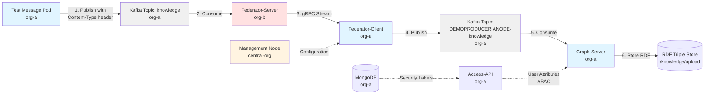

# README  

**Repository:** `[helm-charts]`  
**Description:** `[This is a repository for storing Helm charts to support deployment of an IA Node.]`  
**SPDX-License-Identifier:** `Apache-2.0 AND OGL-UK-3.0`  

## Overview  

The following repository aims to collate a number of Helm charts to support and ease a first time deployment of the IA Node (Integration Architecture Node). The IA Node is an open-source digital component developed as part of the National Digital Twin Programme (NDTP), to support managing and sharing information across organisations. 
This is aimed at being an easy set up for local/dev and should NOT be used `as is` in production.

> [!IMPORTANT]
> Secrets management is outside of the scope of the deployment, however we have provided a few possible examples on how you might override the default values, or provide your own where supported.

>```sh
>git clone https://github.com/National-Digital-Twin/helm-charts.git
>cd helm-charts
>```

## Prerequisites  

The following technologies will need to be installed and configured prior to getting started.

Note: Versions highlighted are based on what configurations have been used throughout the testing of the Helm charts. The commands are all in sh/bash so use WSL2 if in windows.

- **Supported Kubernetes Versions:** 
  - [`Kubernetes 1.23+`](https://kubernetes.io/): a Kubernetes cluster i.e. AKS or local development cluster 
  
- **Required Tooling:**
  - [`kubectl 1.28.9+`](https://kubernetes.io/docs/reference/kubectl/): prior knowledge, usage and experience with `kubectl` 
  - [`Helm 3.8.0+`](https://helm.sh/): prior knowledge, usage and experience in Helm
  - [`jq 1.6+`](https://jqlang.org/): for querying and formating json
  
- **Optional Tooling:**
  - [`K9s 0.32.5+`](https://K9scli.io/): for Kubernetes cluster overview and visualisation of deployments
  
- **Application Installation Requirements:** 
  - [`Istio Helm chart, Gateway, Base and Istiod 1.25.0+`](https://istio.io/latest/docs/setup/install/helm/): service mesh that layers onto existing application, providing uniform and more efficient ways to secure, connect, and monitor services
  - `OpenID Connect (OIDC) Identity Provider:` the application requires that authentication is performed by the service mesh using an OIDC authentication flow and that all paths exposed on the domain should be authenticated, this install was tested with [`Keycloak`](https://www.keycloak.org/) using [`Bitnami Keycloak Helm chart 24.4.13`](https://github.com/bitnami/charts/blob/main/bitnami/keycloak/README.md) which, also installs [`PostgreSQL`](https://www.postgresql.org/).
  - [`OAuth2Proxy`](https://oauth2-proxy.github.io/oauth2-proxy/): a reverse proxy that should be deployed and integrated with Istio service mesh to provide authentication using a target OpenID Connect (OIDC) Identity Provider, this install used [`Bitnami OAuth2 Proxy Helm chart 6.2.10`](https://github.com/bitnami/charts/blob/main/bitnami/oauth2-proxy/README.md), which also installs [`Redis`](https://redis.io/) a session storage option that can be used with OAuth2Proxy
  - [`MongoDB`](https://www.mongodb.com/): for application data storage, this install was tested with the [`MongoDB Community Operator Helm chart 0.12.0+`](https://www.mongodb.com/try/download/community-kubernetes-operator)
  - [`Apache Kafka`](https://kafka.apache.org/): for application data streaming, this install was tested with the [`Kafka Strimzi Operator 0.45.0+`](https://artifacthub.io/packages/helm/strimzi-kafka-operator/strimzi-kafka-operator)


- **System Requirements:** 
  
  The Helm charts included in this repository were tested against a Kubernetes Cluster with the following specification: 
  - Nodes: 3
  - CPU: 8 vCores 
  - Memory: 32 GB 
  - Storage: 64 GB

but can be also ran on smaller setups.

---

## Quick Start  

Follow these steps to get started with the charts in this repository. 

> [!NOTE]
> In all steps replace references to `localhost` with your desired installation domain.

> [!TIP]
> There are some example install/uninstall script under the [scripts](./scripts/) folder that you can also use to help get started. 
in some cases we've added --set commands to reduce cpu and memory request for smaller environments

### 1. Base Platform Setup

#### Kubernetes Cluster

Follow any official documentation to deploy a desired install i.e. [Azure AKS](https://learn.microsoft.com/en-us/azure/aks/what-is-aks), [Amazon EKS](https://docs.aws.amazon.com/eks/latest/userguide/what-is-eks.html), or to run a quick install or testing setup, configure a local development cluster i.e. [minikube](https://kubernetes.io/docs/tutorials/hello-minikube/), [k3s](https://k3s.io/), [microk8s](https://microk8s.io/).

#### Install Helm

Helm is a tool that can be used to package a set of pre-configured Kubernetes resources. To install, refer to the [Helm install guide](https://helm.sh/docs/intro/install/) and [quick start](https://helm.sh/docs/intro/quickstart/). 

### Install Istio 

Any Istio examples throughout this documentation are provided largely as information, to help support integrators to plan their own deployment. 

> [!IMPORTANT]
The installation assumes that Istio has already been installed Istio, following the [Istio Helm Install](https://istio.io/latest/docs/setup/install/helm/) guide, and assumes a default principal of `cluster.local/ns/istio-system/sa/ingressgateway`, and default gateway of `istio-system/istio-gateway`. You will require a [gateway](https://istio.io/latest/docs/reference/config/networking/gateway/) and a domain, listening on HTTPS port (443), presenting a valid TLS certificate. Istio should be integrated with an OIDC conformant Identity Provider (IdP) e.g. Keycloak, Cognito etc. It is required that the IdP be configured with users, clients and groups. The application requires the authentication to be performed by the service mesh using an OIDC authentication flow, which can be done by configuring the Istio options: [global mesh config](https://istio.io/latest/docs/reference/config/istio.mesh.v1alpha1/), or an [Envoy Filter](https://istio.io/latest/docs/reference/config/networking/envoy-filter/). All paths exposed on the domain should be authenticated. That said, for local environments a gateway is optional.

> [!NOTE]
> Istio `authorization policies` are implemented to restrict communications between components. These principals are based on the namespace a service is deployed to and the service account it runs as. In particular, the principal that the Istio ingress is assigned, is environment specific and may differ from the one specified in the default deployment. These can all be overridden using the Helm values. 

> [!TIP]
> for local clusters Istio requests a lot of resources you can do the below to reduce them
> ```sh
> kubectl -n istio-system set resources deployment/istiod --requests=cpu=100m,memory=128Mi
> ```

#### Create Namespace 

Most of the deployment assumes you have a namespace configured as follows:

```sh
kubectl create namespace org-b
kubectl label namespace org-b istio-injection=enabled
kubectl create namespace org-a
kubectl label namespace org-a istio-injection=enabled
```

### 2. Install ia-node-oidc, OIDC Provider and OAuth2Proxy with Redis

### Install Keycloak

> [!NOTE]  
> This section assumes Istio is installed, and configured with a gateway and mesh config or envoy filter to handle the redirection of OAuth2 Proxy.

The following creates a namespace called Keycloak, labels it to ensure Istio envoys are deployed with Keycloak, and deploys Keycloak via its Helm chart.

Note the below --sets for resources are optional and configured for small environments
```sh
kubectl create namespace keycloak
kubectl label namespace keycloak istio-injection=enabled
helm install keycloak oci://registry-1.docker.io/bitnamicharts/keycloak -n keycloak \
  --set image.repository=bitnamilegacy/keycloak \
  --set postgresql.image.repository=bitnamilegacy/postgresql \
  --set global.security.allowInsecureImages=true \
  --set resources.requests.cpu=50m \
  --set resources.requests.memory=256Mi \
  --set postgresql.primary.resources.requests.cpu=50m \
  --set postgresql.primary.resources.requests.memory=128Mi
```
You will need to create a virtual service and configure a realm. 

> [!NOTE]  
> Note: The example realms [realm-ianode.json](./config/realm-ianode.json) & [realm-management-node.json](./config/realm-management-node.json), can be imported as a reference/starting point. This example includes example clients and a group client scope that maps both group membership and realm roles mappers, however only one of these options are required. 
(NS. to tidy up and fix)

> [!TIP]
> some notes to help install the realms
>
> decode the new keycloak secret `keycloak` its in the name space keycloak
>
> kubectl port-forward -n keycloak svc/keycloak 8080:80
>
>  login 
> 	user: user 
> 	pass:from secret above
> 
> -->Manage realms --> Create realm -> browse : import both realm-management-node.json and realm-ianode.json, realm files
>
> for each
> select new realm -> clients .choose ia-node or management node from list -> credentials -> client secret -> regenerate and then copy (and note)

make a secret for each for future ref
```
kubectl -n keycloak create secret generic keycloak-ianode-secret --from-literal=client-secret=*********(from keycloak, that you got above)
kubectl -n keycloak create secret generic keycloak-management-node-client --from-literal=client-secret=*********
```

### Install ia-node-oidc, OAuth2Proxy and Redis 

> [!NOTE]  
> This section assumes Istio is installed, and configured with a gateway and mesh config or envoy filter to handle the redirection of OAuth2 Proxy. In addition it assumes, Keycloak has been deployed on the cluster ie. `http://keycloak.keycloak.svc.cluster.local` with a realm, test users, client and some groups configured. The Keycloak values are configurable if you are using an external install. 

Deploy the [ia-node-oidc](./charts/ia-node-oidc/README.md) helper chart to help with setting up an OIDC conformant Identity Provider (IdP) to work with the IA Node setup.

```sh
helm install ia-node-oidc oci://ghcr.io/national-digital-twin/helm/ia-node-oidc -n org-a --set oidcProvider.configMap.redirect_url="http://localhost/oauth2/callback" --set istio.authorizationPolicy.enabled=false
```
>[!NOTE]
> if this fails with errors, like 
> ```sh
> Error: INSTALLATION FAILED: AuthorizationPolicy.security.istio.io "oauth2-proxy-to-apps" is invalid: [spe...
>```
> then uninstall `helm -n org-a uninstall ia-node-oidc`
> and try again.

A config map and optional secret output is generated by the package, that can then be used to override the OAuth2 Proxy installation. 

Deploy OAuth2Proxy (with Redis) with Helm:  This is used to ensure all endpoints are authenticated using keycloak, can be skipped for local/dev deployments, but you will need a redis
```sh
helm install oauth2-proxy oci://registry-1.docker.io/bitnamicharts/oauth2-proxy -n org-a --set configuration.existingSecret="oauth2-proxy-default" --set configuration.existingConfigmap="oauth2-proxy-default" --set istio.virtualService.hosts[0]="*" --set image.repository=bitnamilegacy/oauth2-proxy --set redis.image.repository=bitnamilegacy/redis --set global.security.allowInsecureImages=true
```

### 3. Install ia-node-mongodb to deploy a MongoDB

> [!NOTE]  
> This section assumes Istio is installed, and configured with a gateway and mesh config or envoy filter to handle the redirection of OAuth2 Proxy. 

MongoDB is used by the access-api to store user security attributes for Attribute-Based Access Control (ABAC) in the graph-server. Multiple graph-server instances can share the same access-api and MongoDB instance.

Deploy the MongoDB community operator with Helm:

Note: The below --set commands are optional and configured for small environments
```sh
helm repo add mongodb https://mongodb.github.io/helm-charts
helm install community-operator mongodb/community-operator --namespace mongodb-operator --create-namespace \
  --set operator.watchNamespace="*" \
  --set operator.resources.requests.cpu=50m \
  --set operator.resources.requests.memory=128Mi \
  --set operator.resources.limits.cpu=200m \
  --set operator.resources.limits.memory=256Mi
```

Deploy the [ia-node-mongodb](./charts/ia-node-mongodb/README.md) helper chart to deploy a MongoDB instance:

Note: The below --set commands are optional and configured for small environments
```sh
helm install ia-node-mongodb oci://ghcr.io/national-digital-twin/helm/ia-node-mongodb -n org-a \
  --set mongodb.spec.members=1 
```

For small enviroments you can change the requests like so
```sh
kubectl patch mongodbcommunity mongodb -n org-a --type=merge -p '
spec:
  statefulSet:
    spec:
      template:
        spec:
          containers:
          - name: mongod
            resources:
              requests:
                cpu: 50m
                memory: 128Mi
              limits:
                cpu: 50m
                memory: 256Mi
          - name: mongodb-agent
            resources:
              requests:
                cpu: 50m
                memory: 128Mi
              limits:
                cpu: 50m
                memory: 256Mi
                '
```

### 4. Install ia-node-kafka to deploy Apache Kafka

> [!NOTE]  
> This section assumes Istio is installed, and configured, with a gateway and mesh config or envoy filter to handle the redirection of OAuth2 Proxy. 

Deploy the Kafka operator with Helm:

Note: The below --set commands are optional and configured for small environments. Strimzi 0.48.0+ is required for Kafka 4.x with KRaft mode.
```sh
helm install my-strimzi-cluster-operator oci://quay.io/strimzi-helm/strimzi-kafka-operator --namespace kafka-operator --create-namespace \
  --set watchAnyNamespace="true" \
  --set resources.requests.cpu=50m \
  --set resources.requests.memory=128Mi \
  --set resources.limits.cpu=500m \
  --set resources.limits.memory=256Mi
```

Deploy the [ia-node-kafka](./charts/ia-node-kafka/README.md) helper chart for use specifically with the integration architecture node (IA Node secure graph component).

Note: The chart defaults to Kafka 4.1.0 with KRaft mode (no ZooKeeper) and single broker/controller for small environments. Use the local chart path if you have made local modifications:
```sh
# For published chart:
helm install ia-node-kafka oci://ghcr.io/national-digital-twin/helm/ia-node-kafka -n org-a 
```
```sh
# For local chart with Kafka 4.1.0 support:
helm install ia-node-kafka ./charts/ia-node-kafka -n org-a
```

> [!NOTE]
> If using Helm 4.0+, you may encounter an error: `metadata.managedFields must be nil`. This is due to Helm 4.0's default server-side apply mode. Use the `--server-side=false` flag to resolve:
> ```sh
> helm install ia-node-kafka ./charts/ia-node-kafka -n org-a --server-side=false
> ```

After Kafka is deployed, you will have:

- Secret `kafka-ia-node-user` (Strimzi KafkaUser secret) containing `sasl.jaas.config` (used by federator client/server examples)
- Secret `kafka-auth-config` containing `kafka-config.properties` with `security.protocol=SASL_PLAINTEXT` for local/dev (used by test-message-pod and other tooling)

> [!NOTE]
> The ia-node-kafka chart defaults to `SASL_PLAINTEXT` on port `:9092` for local/dev simplicity. For production with TLS, override:
> ```sh
> helm install ia-node-kafka ./charts/ia-node-kafka -n org-a \
>   --set kafkaCluster.secret.securityProtocol=SASL_SSL
> ```
> Then tools connecting to `:9093` will need truststore configuration.

For federation, prefer using `kafka-ia-node-user` directly (no need to delete/recreate secrets).

```sh
# Configure all Kafka ACLs in a single patch operation
kubectl patch kafkauser kafka-ia-node-user -n org-a --type='json' -p='[
  {
    "op": "replace",
    "path": "/spec/authorization/acls/0/operations",
    "value": ["Create", "Describe", "DescribeConfigs", "Read", "Write"]
  },
  {
    "op": "replace",
    "path": "/spec/authorization/acls/1/operations",
    "value": ["Create", "Describe", "DescribeConfigs", "Read", "Write"]
  },
  {
    "op": "add",
    "path": "/spec/authorization/acls/-",
    "value": {
      "operations": ["Read"],
      "resource": {
        "type": "group",
        "name": "JenaFusekiKafka-",
        "patternType": "prefix"
      }
    }
  },
  {
    "op": "add",
    "path": "/spec/authorization/acls/-",
    "value": {
      "operations": ["Read"],
      "resource": {
        "type": "group",
        "name": "federator-server",
        "patternType": "literal"
      }
    }
  },
  {
    "op": "add",
    "path": "/spec/authorization/acls/-",
    "value": {
      "operations": ["Read"],
      "resource": {
        "type": "group",
        "name": "management-node",
        "patternType": "literal"
      }
    }
  },
  {
    "op": "add",
    "path": "/spec/authorization/acls/-",
    "value": {
      "operations": ["Create", "Describe", "Write", "Read"],
      "resource": {
        "type": "topic",
        "name": "DEMOPRODUCERIANODE-",
        "patternType": "prefix"
      }
    }
  },
  {
    "op": "add",
    "path": "/spec/authorization/acls/-",
    "value": {
      "operations": ["Describe", "DescribeConfigs"],
      "resource": {
        "type": "cluster",
        "patternType": "literal"
      }
    }
  },
  {
    "op": "add",
    "path": "/spec/authorization/acls/-",
    "value": {
      "operations": ["Describe", "DescribeConfigs"],
      "resource": {
        "type": "topic",
        "name": "DEMOPRODUCERIANODE-",
        "patternType": "prefix"
      }
    }
  }
]'
```

Verify the ACLs were added:
```sh
kubectl get kafkauser kafka-ia-node-user -n org-a -o jsonpath='{.spec.authorization.acls}' | jq '.'
```

> [!NOTE]
> The ACLs configured above provide:
> - **Consumer group access**: Allows graph-server (JenaFusekiKafka-*), federator-server, and management-node polling to read from Kafka
> - **Federated topic access**: Allows federator-client to create and write to DEMOPRODUCERIANODE-* topics, and graph-server to read from them
> - **Cluster-level operations**: Allows DESCRIBE and DESCRIBE_CONFIGS operations on the cluster for metadata operations (required for AdminClient, prevents authentication failures and broker crashes)
> - **Topic metadata access**: Allows DESCRIBE and DESCRIBE_CONFIGS on DEMOPRODUCERIANODE-* topics so graph-server can access topic metadata
> - **Source topic metadata**: Allows DESCRIBE_CONFIGS on knowledge and ontology topics to prevent broker crashes when AdminClient operations are performed
> - **Federator-server**: Allows federator-server to read from kafka
>
> **Critical**: The `DescribeConfigs` operation must be granted on ALL topics (source and federated) to prevent Kafka broker crashes due to repeated authorization denials. Without this permission, the broker will fail readiness probes and restart continuously.

### 5. Install IA Node to deploy the IA Node Applications

> [!NOTE]  
> This section assumes Istio is installed, and configured with a gateway and mesh config or envoy filter to handle the redirection of OAuth2 Proxy and that this is now integrated with an identity provider. In addition it assumes, MongoDB and Kafka have been deployed on the cluster i.e. `mongodb-svc:27017` and `kafka-cluster-kafka-bootstrap:9092` respectively, are using secret names of `ia-node-user-password` and `kafka-auth-config` respectively. These can all be overridden in the values as required, along with any other requirements if you are hosting these services externally. 

The ia-node chart includes multiple components. By default, only the access-api is enabled. For a full IA Node deployment including the secure graph-server, enable it with `--set apps.graph.enabled=true` and configure Kafka to use port 9092 (SASL_PLAINTEXT):

Note: The below --set commands for resources are optional and configured for small environments. Use the local chart if deploying with federator support (fusekiConfig.kafkaTopics):

```sh
helm -n org-a install ia-node ./charts/ia-node \
--set apps.api.configMap.data.DEPLOYED_DOMAIN="http://localhost" \
--set apps.api.configMap.data.OPENID_PROVIDER_URL="http://keycloak.keycloak.svc.cluster.local/realms/ianode/" \
--set apps.graph.configMap.data.JWKS_URL="http://keycloak.keycloak.svc.cluster.local/realms/ianode/protocol/openid-connect/certs" \
--set apps.graph.configMap.data.USER_ATTRIBUTES_URL="http://access-api.org-a.svc.cluster.local:8080/users/lookup/{user}" \
--set apps.graph.configMap.data.ATTRIBUTE_HIERARCHY_URL="http://access-api.org-a.svc.cluster.local:8080/hierarchies/lookup/{name}" \
--set apps.graph.enabled=true \
--set apps.api.deployment.resources.requests.cpu=25m \
--set apps.graph.statefulSet.resources.requests.cpu=25m \
--set apps.graph.statefulSet.resources.requests.memory=128Mi \
--set kafkaCluster.bootstrapServers="kafka-cluster-kafka-bootstrap.org-a.svc.cluster.local:9092" \
--set fusekiConfig.cqrsEnabled=false \
--set fusekiConfig.kafkaTopics.knowledge="DEMOPRODUCERIANODE-knowledge" \
--set fusekiConfig.kafkaTopics.ontology="DEMOPRODUCERIANODE-ontology.car.models" \
--set istio.virtualService.hosts[0]="localhost"
```

> [!NOTE]
> The ia-node chart contains:
> - **access-api** (enabled by default): User access control API for managing ABAC permissions
> - **graph-server** (disabled by default): The secure-agent-graph component for RDF triple store with Kafka integration
> - **access-ui** (disabled): Web UI for access management
> - **query-ui** (disabled): Web UI for querying the graph
> 
> Enable additional components as needed with `--set apps.<component>.enabled=true`

> [!TIP]
> If deploying MongoDB or Kafka in a different namespace, you may need to copy the authentication secrets to the org-a namespace:
>
> ```sh
> # Example: Copy MongoDB password secret
> kubectl apply -f - <<EOF
> apiVersion: v1
> kind: Secret
> metadata:
>   name: ia-node-user-password
>   namespace: org-b
> type: Opaque
> data:
>   password: <base64-encoded-password-from-MongoDB-install>
> EOF
> ```
>
> To get the base64-encoded password from the MongoDB installation:
> ```sh
> kubectl get secret <mongodb-secret-name> -n <mongodb-namespace> -o jsonpath='{.data.password}'
> ```


### 6. Federation Setup

Below are notes on setting up the federation components. This assumes you're in a dev environment and forgoes many of the security features; these can easily be enabled in the full multi-tenanted deployment.

---

#### Managment Node

### Postgress 
used to store config's used by the federators

```sh
kubectl create namespace central-org
kubectl label namespace central-org istio-injection=enabled
helm repo add bitnami https://charts.bitnami.com/bitnami
helm upgrade --install management-postgres bitnami/postgresql -n central-org \
 --set architecture=standalone  \
 --set auth.username=mn_user \
 --set auth.password=<choose password> \
 --set auth.database=management_node \
 --set primary.persistence.enabled=true
```
> [!NOTE]
> If the above fails with a `-bash: choose: No such` error, then you forgot to replace the `<choose password>` bit with an actuall password !

### Management Node

> [!NOTE]
> When SSL is disabled (as in this dev setup), no certificate secret is required. For production deployments with SSL enabled, you would need to create a secret with keystore.jks and truststore.jks files.

#### Get the Postgress user password from the secret created by above chart and the Keycloak client secret for the managment client
```sh
POSTGRESS_PASSWORD=$(kubectl get secret management-postgres-postgresql -n central-org -o jsonpath='{.data.password}' | base64 -d)

CLIENT_SECRET=$(kubectl get secret keycloak-management-node-client -n keycloak -o jsonpath='{.data.client-secret}' | base64 -d)
```


```sh
helm upgrade --install management-node ./charts/management-node \
  -n central-org \
  --set app.datasource.secret.username=mn_user \
  --set app.datasource.secret.password=${POSTGRESS_PASSWORD} \
  --set app.datasource.secret.create=true \
  --set app.datasource.url=jdbc:postgresql://management-postgres-postgresql.central-org.svc.cluster.local:5432/management_node \
  --set image.repository=ghcr.io/national-digital-twin/management-node/management-node \
  --set image.tag=1.0.1 \
  --set app.ssl.enabled=false \
  --set app.oauth2.resourceserver.jwt.issuerUri=http://keycloak.keycloak.svc.cluster.local/realms/management-node \
  --set app.oauth2.resourceserver.jwt.jwkSetUri=http://keycloak.keycloak.svc.cluster.local/realms/management-node/protocol/openid-connect/certs \
  --set app.oauth2.resourceserver.opaquetoken.introspectionUri=http://keycloak.keycloak.svc.cluster.local/realms/management-node/protocol/openid-connect/token/introspect \
  --set app.oauth2.resourceserver.opaquetoken.clientSecret=${CLIENT_SECRET} \
  --set app.oauth2.resourceserver.jwt.jwsAlgorithm=RS256
```

#### Configure Management Node with test data

First, extract the PostgreSQL password from the secret:
```sh
PGPASSWORD=$(kubectl get secret management-postgres-postgresql -n central-org -o jsonpath='{.data.password}' | base64 -d)
```


Insert demo configuration for federator testing:
```sh
PGPASSWORD=$(kubectl get secret management-postgres-postgresql -n central-org -o jsonpath='{.data.password}' | base64 -d)

# Insert consumer
kubectl exec -n central-org management-postgres-postgresql-0 -- bash -c "PGPASSWORD=$PGPASSWORD psql -U mn_user -d management_node -c \"INSERT INTO mn.consumer (idp_client_id, name, org_id) VALUES ('management-node', 'IA-NODE-CONSUMER-1', 1);\""

# Insert producer - pointing to federator-server (not management-node)
kubectl exec -n central-org management-postgres-postgresql-0 -- bash -c "PGPASSWORD=$PGPASSWORD psql -U mn_user -d management_node -c \"INSERT INTO mn.producer (idp_client_id, name, description, host, port, active, tls, org_id) VALUES ('management-node', 'DEMO-PRODUCER-IA-NODE', 'Demo producer for IA Node', 'federator-server.org-b.svc.cluster.local', 9001, true, false, 1);\""

# Add product_type column (required for federator-client)
kubectl exec -n central-org management-postgres-postgresql-0 -- bash -c "PGPASSWORD=$PGPASSWORD psql -U mn_user -d management_node -c \"ALTER TABLE mn.product ADD COLUMN IF NOT EXISTS product_type VARCHAR(50);\""

# Insert products with product_type
kubectl exec -n central-org management-postgres-postgresql-0 -- bash -c "PGPASSWORD=$PGPASSWORD psql -U mn_user -d management_node -c \"INSERT INTO mn.product (name, topic, product_type, producer_id) SELECT 'CarModelsKnowledge', 'knowledge', 'KNOWLEDGE', id FROM mn.producer WHERE idp_client_id = 'management-node';\""

kubectl exec -n central-org management-postgres-postgresql-0 -- bash -c "PGPASSWORD=$PGPASSWORD psql -U mn_user -d management_node -c \"INSERT INTO mn.product (name, topic, product_type, producer_id) SELECT 'CarModelsOntology', 'ontology.car.models', 'ONTOLOGY', id FROM mn.producer WHERE idp_client_id = 'management-node';\""

# Link the products to the built-in `topic` product type (id=1)
kubectl exec -n central-org management-postgres-postgresql-0 -- bash -c "PGPASSWORD=$PGPASSWORD psql -U mn_user -d management_node -c \"UPDATE mn.product SET product_type_id = 1 WHERE name IN ('CarModelsKnowledge', 'CarModelsOntology');\""

# Link products to consumer
kubectl exec -n central-org management-postgres-postgresql-0 -- bash -c "PGPASSWORD=$PGPASSWORD psql -U mn_user -d management_node -c \"INSERT INTO mn.product_consumer (product_id, consumer_id, granted_ts, validity) SELECT p.id, c.id, '2025-11-06 00:00:00', 365 FROM mn.product p, mn.consumer c WHERE p.name = 'CarModelsKnowledge' AND c.idp_client_id = 'management-node';\""

kubectl exec -n central-org management-postgres-postgresql-0 -- bash -c "PGPASSWORD=$PGPASSWORD psql -U mn_user -d management_node -c \"INSERT INTO mn.product_consumer (product_id, consumer_id, granted_ts, validity) SELECT p.id, c.id, '2025-11-06 00:00:00', 365 FROM mn.product p, mn.consumer c WHERE p.name = 'CarModelsOntology' AND c.idp_client_id = 'management-node';\""

# Update the polling schedule to run every 4 hours
kubectl exec -n central-org management-postgres-postgresql-0 -- bash -c "PGPASSWORD=$PGPASSWORD psql -U mn_user -d management_node -c \"UPDATE mn.product_consumer SET schedule_type = 'cron', schedule_expression = '0 */4 * * *' WHERE id IN (4, 5);\""

echo "Configuration added successfully"
```

Then check existing consumers and producers:
```sh
kubectl exec -n central-org management-postgres-postgresql-0 -- bash -c "PGPASSWORD=$PGPASSWORD psql -U mn_user -d management_node -c \"SELECT id, idp_client_id, name FROM mn.consumer;\""
kubectl exec -n central-org management-postgres-postgresql-0 -- bash -c "PGPASSWORD=$PGPASSWORD psql -U mn_user -d management_node -c \"SELECT id, idp_client_id, name, host FROM mn.producer;\""
```

Verify the configuration was inserted:
```sh
PGPASSWORD=$(kubectl get secret management-postgres-postgresql -n central-org -o jsonpath='{.data.password}' | base64 -d)
kubectl exec -n central-org management-postgres-postgresql-0 -- bash -c "PGPASSWORD=$PGPASSWORD psql -U mn_user -d management_node -c \"
SELECT 
  c.idp_client_id as consumer,
  p.name as product,
  p.topic,
  pr.name as producer_name,
  pr.host as producer_host,
  pr.port as producer_port,
  COUNT(pca.id) as filter_attribute_count
FROM mn.consumer c
JOIN mn.product_consumer pc ON c.id = pc.consumer_id
JOIN mn.product p ON pc.product_id = p.id
JOIN mn.producer pr ON p.producer_id = pr.id
LEFT JOIN mn.product_consumer_attribute pca ON pc.id = pca.product_consumer_id
WHERE c.idp_client_id = 'management-node'
GROUP BY c.idp_client_id, p.name, p.topic, pr.name, pr.host, pr.port;
\""
```

Expected output:
```
    consumer     |      product       |        topic        |    producer_name      |                producer_host                 | producer_port | filter_attribute_count 
-----------------+--------------------+---------------------+-----------------------+----------------------------------------------+---------------+------------------------
 management-node | CarModelsKnowledge | knowledge           | DEMO-PRODUCER-IA-NODE | federator-server.org-b.svc.cluster.local    |          9001 |                      0
 management-node | CarModelsOntology  | ontology.car.models | DEMO-PRODUCER-IA-NODE | federator-server.org-b.svc.cluster.local    |          9001 |                      0
```
```
## Federator Client

[!NOTE] used org-a as the namespace here, but change this to suit.

create namespace  org-a (if not done earlier)

```sh
kubectl create namespace org-a
kubectl label namespace org-a istio-injection=enabled
```

make a secret containing the certs and trust stores needed for mtls, we are disabling mtls here but still need a dummy secret for the federator client to start!

```sh
# Create valid empty truststore for federator-client
keytool -genkeypair -alias dummy -keystore /tmp/truststore.jks \
  -storepass changeit -keypass changeit -dname "CN=dummy" -keyalg RSA
keytool -delete -alias dummy -keystore /tmp/truststore.jks -storepass changeit

# Create cert secret
kubectl  -n org-a create secret generic federator-client-certs \
  --from-file=truststore.jks=/tmp/truststore.jks 
```

```sh
# Copy Keycloak client secret from keycloak namespace
kubectl get secret keycloak-management-node-client -n keycloak -o yaml | sed 's/namespace: keycloak/namespace: org-a/' | kubectl apply -f -
kubectl get secret keycloak-management-node-client -n keycloak -o yaml | sed 's/namespace: keycloak/namespace: org-b/' | kubectl apply -f -
```

> [!NOTE]
> The `kafka-ia-node-user` secret is automatically created by the ia-node-kafka chart in the namespace where it was installed (org-a in this example). If your federator-client is in a different namespace, copy it across:
> ```sh
> kubectl get secret kafka-ia-node-user -n org-a -o yaml | sed 's/namespace: org-a/namespace: <your-client-namespace>/' | kubectl apply -f -
> ```


for the below you will need to supply settings for your environment. see [values-client-example.yaml](./charts/federator/examples/values-client-example.yaml)

Create the federator-client connection config secret (this file typically contains client credentials, so keep it in a Secret):


```sh
helm upgrade --install federator-client ./charts/federator --namespace org-a --values ./charts/federator/examples/values-client-example.yaml
```


## Federator Server

needs information about connections to management node, Keycloak, redis and also the cert and truststore

create namespace (if not already created for ia-node)
```sh
kubectl create namespace org-b
kubectl label namespace org-b istio-injection=enabled
```

Copy authentication secrets from org-a to org-b (for accessing shared Kafka and MongoDB):

```sh
# Copy Kafka user secret (JAAS) for federator-server
kubectl get secret kafka-ia-node-user -n org-a -o json \
 | jq 'del(
     .metadata.namespace,
     .metadata.resourceVersion,
     .metadata.uid,
     .metadata.creationTimestamp,
     .metadata.managedFields,
     .metadata.ownerReferences,
     .metadata.labels
   )
   | .metadata.namespace="org-b"' \
 | kubectl apply -f -

# Copy MongoDB password secret (if graph-server will be deployed in org-a)
kubectl get secret ia-node-user-password -n org-a -o yaml | sed 's/namespace: org-a/namespace: org-b/' | kubectl apply -f -

# Copy redis password
kubectl get secret oauth2-proxy-redis -n org-a -o yaml | sed 's/namespace: org-a/namespace: org-b/' | kubectl apply -f -
```

> [!IMPORTANT]
> **Cross-namespace secret requirements for federator-server:**
> 
> The example values reference secrets that may not exist in the deployment namespace (org-b):
> - `kafka-ia-node-user` - created in org-a by the ia-node-kafka chart (copy it to org-b as shown)
> - `keycloak-management-node-client` - created in keycloak namespace
> 
> **Options:**
> 1. **Copy secrets to org-b** (if using same cluster):
>    ```sh
>    kubectl get secret keycloak-management-node-client -n keycloak -o yaml | sed 's/namespace: keycloak/namespace: org-b/' | kubectl apply -f -
>    kubectl get secret kafka-ia-node-user -n org-a -o json \
>     | jq 'del(
>         .metadata.namespace,
>         .metadata.resourceVersion,
>         .metadata.uid,
>         .metadata.creationTimestamp,
>         .metadata.managedFields,
>         .metadata.ownerReferences,
>         .metadata.labels
>       )
>       | .metadata.namespace="org-b"' \
>     | kubectl apply -f -
>    ```
> 
> 2. **Use hardcoded values in values-server-example.yaml** (as shown in example file):
>    - (Removed) The federator chart examples avoid embedding secrets in values.
> 
> 3. **Production: Use a secret management solution** (recommended):
>    - External Secrets Operator, Vault, AWS Secrets Manager, etc.

```

make a secret containing the certs and trust stores needed for mtls, we are disabling mtls here but still need a dummy secret for the federator server to start!

```sh
# Create valid empty truststore for federator-server
keytool -genkeypair -alias dummy -keystore /tmp/truststore.jks \
  -storepass changeit -keypass changeit -dname "CN=dummy" -keyalg RSA -keysize 2048
keytool -delete -alias dummy -keystore /tmp/truststore.jks -storepass changeit

# Create valid empty keystore for federator-server (required even when mTLS is disabled)
keytool -genkeypair -alias dummy -keystore /tmp/keystore.p12 -storetype PKCS12 \
  -storepass changeit -keypass changeit -dname "CN=dummy" -keyalg RSA -keysize 2048

# Create Kubernetes secret with both truststore and keystore
kubectl -n org-b create secret generic federator-server-certs \
  --from-file=truststore.jks=/tmp/truststore.jks \
  --from-file=keystore.p12=/tmp/keystore.p12

```

> [!NOTE]
> Before deploying, ensure all required secrets exist in the org-b namespace. See the cross-namespace secret requirements note above and the REQUIRED SECRETS section in values-server-example.yaml.

for the below you will need to supply settings for your environment. see [values-server-example.yaml](./charts/federator/examples/values-server-example.yaml)

```sh
helm upgrade --install federator-server ./charts/federator --namespace org-b --values ./charts/federator/examples/values-server-example.yaml
```

## Verifying Installation

Now we need to insert some test data so we can see if the data flows properly.

### Insert test user for access-api

The graph-server uses Attribute-Based Access Control (ABAC) to filter RDF data based on user security labels. We need to create a user that matches the JWT token's email claim with appropriate security clearances.

> [!IMPORTANT]
> When using Keycloak client_credentials grant (as in this example), the JWT token will contain `user@test.com` as the email claim. The user in MongoDB must have this exact email and possess security labels that allow access to the federated data.

```sh
MONGODB_PASSWORD=$(kubectl get secret mongodb-access-ia-node-user -n org-a -o jsonpath='{.data.password}' | base64 -d)
kubectl exec -n org-a mongodb-0 -c mongod -- mongosh --quiet -u ia-node-user -p "$MONGODB_PASSWORD" --authenticationDatabase access access --eval '
db.users.deleteMany({email: "user@test.com"});
db.users.insertOne({
  externalId: "service-account-ianode",
  name: "Service Account IANode",
  userName: "service-account-ianode",
  email: "user@test.com",
  labels: [
    {
      name: "clearance",
      value: "TS",
      toString: "clearance=\"TS\"",
      toDataLabelString: "classification=\"TS\""
    },
    {
      name: "nationality",
      value: "GBR",
      toString: "nationality=\"GBR\"",
      toDataLabelString: "permitted_nationalities=\"GBR\""
    },
    {
      name: "deployed_organisation",
      value: "ExampleOrg",
      toString: "deployed_organisation=\"ExampleOrg\"",
      toDataLabelString: "permitted_organisations=\"ExampleOrg\""
    },
    {
      name: "personnel_type",
      value: "GOV",
      toString: "personnel_type=\"GOV\"",
      toDataLabelString: null
    }
  ],
  active: true,
  groups: [],
  userGroups: [],
  schemas: ["urn:ietf:params:scim:schemas:core:2.0:User"]
});
'
```

Verify the user was inserted:
```sh
MONGODB_PASSWORD=$(kubectl get secret mongodb-access-ia-node-user -n org-a -o jsonpath='{.data.password}' | base64 -d)
kubectl exec -n org-a mongodb-0 -c mongod -- mongosh --quiet -u ia-node-user -p "$MONGODB_PASSWORD" --authenticationDatabase access access --eval 'db.users.find({email: "user@test.com"}, {userName: 1, email: 1, labels: 1, active: 1}).pretty()'
```

> [!NOTE]
> The security labels assigned to the user determine what RDF data they can access:
> - **clearance**: Controls access based on data classification levels (e.g., TS = Top Secret)
> - **nationality**: Restricts access based on permitted nationalities
> - **deployed_organisation**: Limits access to data from specific organizations
> - **personnel_type**: Additional personnel classification (e.g., GOV = Government)
>
> If SPARQL queries return empty results despite data being present, check that the user's security labels match the labels attached to the RDF data.


### Deploy test-message-pod for sending test messages

The test-message-pod chart provides a simple way to send test messages to Kafka for federation testing.

#### Install test-message-pod

First, build the Docker image:
```sh
cd charts/test-message-pod
docker build -t test-message-pod:local .
# kind load docker-image test-message-pod:local --name kind # if your using kind
cd ../..
```

Then install the chart:
```sh
helm install test-msg ./charts/test-message-pod -n org-a \
  --set kafka.bootstrapServer=kafka-cluster-kafka-bootstrap.org-a.svc.cluster.local:9092 \
  --set kafka.topic=knowledge \
  --set kafka.securityProtocol=SASL_PLAINTEXT \
  --set kafkaCredentialsSecret.name=kafka-auth-config \
  --set resources.requests.cpu=5m \
  --set resources.requests.memory=16Mi
```

#### install kafka Ui great tool for see topic and message state

Get the Kafka user password from the secret:
```sh
KAFKA_PASSWORD=$(kubectl get secret kafka-ia-node-user -n org-a -o jsonpath='{.data.password}' | base64 -d)
```

Install Kafka UI:
```sh
helm repo add kafka-ui https://provectus.github.io/kafka-ui-charts

helm upgrade --install kafka-ui kafka-ui/kafka-ui \
  -n org-a \
  --reset-values \
  --set yamlApplicationConfig.kafka.clusters[0].name=kind-cluster \
  --set yamlApplicationConfig.kafka.clusters[0].bootstrapServers=kafka-cluster-kafka-bootstrap.org-a.svc.cluster.local:9092 \
  --set-string yamlApplicationConfig.kafka.clusters[0].properties.security\.protocol=SASL_PLAINTEXT \
  --set-string yamlApplicationConfig.kafka.clusters[0].properties.sasl\.mechanism=SCRAM-SHA-512 \
  --set-string yamlApplicationConfig.kafka.clusters[0].properties.sasl\.jaas\.config="org.apache.kafka.common.security.scram.ScramLoginModule required username=\"kafka-ia-node-user\" password=\"${KAFKA_PASSWORD}\";" \
  --set volumeMounts[0].name=kafka-auth-config \
  --set volumeMounts[0].mountPath=/kafka-auth \
  --set volumeMounts[0].readOnly=true \
  --set volumes[0].name=kafka-auth-config \
  --set volumes[0].secret.secretName=kafka-auth-config
```

follow the text onscreen after install to port forward and open the UI.

#### jobRunr
inside the federtor client there is a jobrunr which controls the jobs for fetching new data from the server. you can expose the control dashboard for this and trigger jobs manually.
```sh
kubectl -n org-a port-forward deployment/federator-client 8085:8085
```
navigate to that page you you will see the UI.

#### Send test messages

> [!IMPORTANT]
> For federation to work correctly, RDF messages **MUST include a `Content-Type:application/trig` header** and be sent as **complete documents in a single Kafka message**. The federator-server requires this header to properly identify and parse RDF content. The built-in script handles both requirements automatically.
>
> **Note:** For local/dev on kind, this guide uses Kafka's **SASL_PLAINTEXT listener on port 9092**. If you're targeting a TLS listener (or AWS MSK), set `kafka.securityProtocol=SASL_SSL` and use the appropriate TLS port.

```sh
# Send the included test data file (script automatically includes header and sends as single message)
kubectl exec -n org-a test-msg-test-message-pod -- /opt/scripts/send-kafka-message.sh /tmp/test-data.trig
```

> [!NOTE]
> The built-in script automatically handles two critical requirements:
> 1. **Content-Type header**: Adds `Content-Type:application/trig` header so federator-server can identify and parse RDF content
> 2. **Single message format**: Uses `tr "\n" " "` to convert newlines to spaces, ensuring the entire RDF document is sent as one Kafka message
> 3. **Istio port exclusions**: The install command adds `traffic.sidecar.istio.io/excludeOutboundPorts=9092` (using `--set-string`) so the Envoy sidecar does not intercept Kafka's plaintext listener. Without this exclusion, connections terminate during authentication.
>
> Without the Content-Type header, federator-server will fail to process messages with parsing errors and return 0 messages to federator-client. Without single-message format, `kafka-console-producer` treats each line as a separate message, causing errors like: `Expected BNode or IRI: Got: [KEYWORD:PREFIX]`

#### Verify federation flow

The federation flow is: **Kafka (org-a) → Federator-Server (org-b) → gRPC → Federator-Client (org-a) → Kafka (org-a) → Graph-Server (org-a)**



After sending a test message to the knowledge topic in org-a, the federator-server makes it available via gRPC. The federator-client polls the management-node for configuration, then pulls messages from the federator-server via gRPC, and writes them back to Kafka in org-a with the DEMOPRODUCERIANODE- prefix. The graph-server in org-a consumes these federated messages and stores them in the RDF triple store.

**Important:** The federator-client's gRPC connection is configured in the `connection-configuration.json` file mounted at `/config/connection-configuration.json` (provided via the `federator-client-connection-config` Secret in the example values). Ensure this points to the correct federator-server endpoint:

```yaml
connection-configuration.json: |-
  [
    {
      "credentials": {
        "name": "default",
        "key": "demo-api-key"
      },
      "server": {
        "name": "FederatorServerOrgB",
        "host": "federator-server.org-b.svc.cluster.local",
        "port": 9001
      },
      "tls": {
        "enabled": false
      }
    }
  ]
```

The federator-client writes messages back to org-a's Kafka (configured via `kafka.bootstrapServers` in client.properties):
```yaml
kafka.bootstrapServers=kafka-cluster-kafka-bootstrap.org-a.svc.cluster.local:9092
```

The graph-server in org-a also consumes from org-a's Kafka:
```yaml
kafkaCluster.bootstrapServers=kafka-cluster-kafka-bootstrap.org-a.svc.cluster.local:9092
```

**Polling Interval Configuration:**

The federator-client polling interval is controlled by the `schedule_type` and `schedule_expression` columns in the management-node database (`mn.product_consumer` table). 

To set polling to every minute, update the database:
```sql
-- Update schedule to every minute (cron format: * * * * *)
UPDATE mn.product_consumer 
SET schedule_type = 'cron', schedule_expression = '* * * * *' 
WHERE consumer_id IN (SELECT id FROM mn.consumer WHERE idp_client_id = 'management-node');

-- Or use interval format: PT1M
UPDATE mn.product_consumer 
SET schedule_type = 'interval', schedule_expression = 'PT1M' 
WHERE consumer_id IN (SELECT id FROM mn.consumer WHERE idp_client_id = 'management-node');
```

**Note:** This requires management-node v1.1.0+ with Flyway migration `V20251013135880__add_schedule_expression.sql` applied. If using an older version, the federator-client defaults to PT10M (10 minute polling).

Check the federator-client logs to verify it's processing messages:
```sh
# Check if federator-client fetched configuration from management-node
kubectl logs -n org-a -l app.kubernetes.io/name=federator-client --tail=100 | grep "Config fetched"

# Check the registered job interval
kubectl logs -n org-a -l app.kubernetes.io/name=federator-client --tail=100 | grep "Registered recurring job"

# Wait for the next scheduled job run and check for message processing
kubectl logs -n org-a -l app.kubernetes.io/name=federator-client --follow
```

Check the federator-server logs to see if it's consuming from Kafka:
```sh
kubectl logs -n org-b -l app.kubernetes.io/name=federator-server --tail=100
```

#### Verify data has been received by graph-server

Query the graph-server to verify that federated data has been successfully ingested:

```sh
CLIENT_SECRET=$(kubectl get secret keycloak-ianode-secret -n keycloak -o jsonpath='{.data.client-secret}' | base64 -d)
kubectl exec -n org-a graph-server-0 -- bash -c "
TOKEN=\$(curl -s -X POST 'http://keycloak.keycloak.svc.cluster.local/realms/ianode/protocol/openid-connect/token' \
  -H 'Content-Type: application/x-www-form-urlencoded' \
  -d 'grant_type=client_credentials' \
  -d 'client_id=ianode' \
  -d 'client_secret=${CLIENT_SECRET}' \
  | sed -n 's/.*\"access_token\":\"\([^\"]*\)\".*/\1/p')

curl -s -X POST 'http://localhost:3030/knowledge/query' \
  -H \"Authorization: Bearer \$TOKEN\" \
  -H 'Content-Type: application/sparql-query' \
  -H 'Accept: application/sparql-results+json' \
  --data-binary 'SELECT * WHERE { ?s ?p ?o } LIMIT 10'
"
```

**Expected output:** JSON with SPARQL results containing RDF triples.

**If no data is returned:**

1. **Check if data was ingested by graph-server:**
   ```sh
   kubectl logs -n org-a graph-server-0 --tail=100 | grep "DEMOPRODUCERIANODE-knowledge"
   ```
   Look for: `Batch: Finished [X, Y]` indicating successful message processing.

2. **Check for authorization errors:**
   ```sh
   kubectl logs -n org-a graph-server-0 --tail=50 | grep -E "403|Rejected|No request attributes"
   ```
   If you see "No request attributes for user", the MongoDB user is missing or lacks required security labels.

3. **Verify user exists with correct email:**
   ```sh
   MONGODB_PASSWORD=$(kubectl get secret mongodb-access-ia-node-user -n org-a -o jsonpath='{.data.password}' | base64 -d)
   kubectl exec -n org-a mongodb-0 -c mongod -- mongosh --quiet -u ia-node-user -p "$MONGODB_PASSWORD" --authenticationDatabase access access --eval 'db.users.findOne({email: "user@test.com"})'
   ```

4. **Check federation flow status:**
   ```sh
   # Verify messages in DEMOPRODUCERIANODE-knowledge topic
   kubectl logs -n org-a graph-server-0 --since=30m | grep "Batch:" | tail -5
   ```

> [!NOTE]
> The graph-server endpoint is `/knowledge/query` not `/knowledge/sparql`. Data is ingested via the `/knowledge/upload` endpoint (used by Kafka consumer) and queried via `/knowledge/query`.

### Troubleshooting Federation

#### Federator-Server Not Processing Messages (Returns 0 Messages)

If federator-client logs show `Received response from Server: 0` despite messages existing in the source topic:

**Problem:** The federator-server requires a `Content-Type:application/trig` header to identify and parse RDF messages.

**Symptoms:**
- Federator-server logs show: `Kafka Header: ''` (empty header)
- Federator-server processes messages but encounters parsing errors
- Federator-client receives 0 messages from the server
- Messages exist in source topic but aren't federated

**Solution:** Ensure all messages include the Content-Type header:
```sh
# ✓ CORRECT - Include Content-Type header
PAYLOAD=$(cat /tmp/test-data.trig | tr "\n" " ")
echo -e "Content-Type:application/trig\t$PAYLOAD" | \
kafka-console-producer.sh \
  --bootstrap-server kafka-cluster-kafka-bootstrap.org-a.svc.cluster.local:9092 \
  --topic knowledge \
  --producer.config /opt/kafka/config/kafka-config.properties \
  --property parse.headers=true \
  --property headers.key.separator=: \
  --property headers.delimiter=$'\t'
```

**Verification:**
Check federator-server logs for the Content-Type header:
```sh
kubectl logs -n org-b -l app.kubernetes.io/name=federator-server --tail=100 | grep "Kafka Header"
```

You should see:
```
Kafka Header: 'Content-Type: application/trig'
Processed message. Offset: 'X'
```

If you see `Kafka Header: ''`, the messages are missing the required header.

#### ACL Authorization Issues

If you see `TopicAuthorizationException: Not authorized to access topics: [DEMOPRODUCERIANODE-knowledge]` in the federator-client logs:

1. **Verify ACL exists in KafkaUser spec:**
   ```sh
   kubectl get kafkauser kafka-ia-node-user -n org-a -o jsonpath='{.spec.authorization.acls}' | jq '.[] | select(.resource.name | startswith("DEMO"))'
   ```

2. **Check KafkaUser reconciliation status:**
   ```sh
   kubectl get kafkauser kafka-ia-node-user -n org-a -o jsonpath='{.status}' | jq
   ```
   Ensure `status.conditions[].type` is `Ready` and `status` is `True`.

3. **Verify topic exists or can be auto-created:**
   ```sh
   kubectl exec -n org-a test-msg-test-message-pod -- /tmp/kafka/bin/kafka-topics.sh \
     --bootstrap-server kafka-cluster-kafka-bootstrap.org-a.svc.cluster.local:9092 \
     --list | grep DEMO
   ```

4. **If prefix pattern ACLs don't work, try creating explicit topic and literal ACL:**
   ```sh
   # Create topic explicitly
   kubectl apply -f - <<EOF
   apiVersion: kafka.strimzi.io/v1beta2
   kind: KafkaTopic
   metadata:
     name: demoproducerianode-knowledge
     namespace: org-a
     labels:
       strimzi.io/cluster: kafka-cluster
   spec:
     partitions: 1
     replicas: 1
     config:
       retention.ms: 604800000
   EOF
   
   # Add literal ACL
   kubectl patch kafkauser kafka-ia-node-user -n org-a --type='json' -p='[
     {
       "op": "add",
       "path": "/spec/authorization/acls/-",
       "value": {
         "operations": ["Create", "Describe", "Read", "Write"],
         "resource": {
           "type": "topic",
           "name": "DEMOPRODUCERIANODE-knowledge",
           "patternType": "literal"
         }
       }
     }
   ]'
   ```

5. **After making ACL changes, always restart the federator-client:**
   ```sh
   kubectl rollout restart deployment federator-client -n org-a
   ```

#### RDF Parsing Errors in Federator-Server

If you see errors like `ERROR org.apache.jena.riot - [line: 1, col: 1 ] Expected BNode or IRI: Got: [KEYWORD:PREFIX]` in the federator-server logs:

**Problem:** The federator-server is receiving **line-by-line messages** instead of complete RDF documents. Each line of the RDF file was sent as a separate Kafka message.

**Root Cause:** Using `kafka-console-producer` with default settings treats each line as a separate message:
```sh
# ❌ WRONG - Sends line-by-line
cat /tmp/test-data.trig | kafka-console-producer.sh ...

# ❌ WRONG - Also sends line-by-line  
kafka-console-producer.sh ... < /tmp/test-data.trig
```

**Solution:** Convert newlines to spaces AND include Content-Type header before sending, so the entire RDF document becomes a single Kafka message with proper content identification:
```sh
# ✓ CORRECT - Sends as single message with Content-Type header
PAYLOAD=$(cat /tmp/test-data.trig | tr "\n" " ")
echo -e "Content-Type:application/trig\t$PAYLOAD" | \
kafka-console-producer.sh \
  --property parse.headers=true \
  --property headers.key.separator=: \
  --property headers.delimiter=$'\t' ...
```

**Why this matters:**
- The federator-server **requires** the `Content-Type:application/trig` header to identify and parse RDF messages correctly
- Without this header, federator-server will log `Kafka Header: ''` and fail with parsing errors, returning 0 messages
- Each Kafka message must contain a **complete RDF document** (TriG/Turtle format)
- Line-by-line messages cause the parser to fail: it tries to parse `PREFIX rdf: <...>` as a complete RDF graph
- The federation flow requires: `Complete RDF Document with Header` → Kafka → Federator-Server → gRPC → Federator-Client → Kafka → Graph-Server

**Verification:**
Check if you're receiving complete documents:
```sh
# View a single message from the topic
kubectl exec -n org-a test-msg-test-message-pod -- bash -c '
/tmp/kafka/bin/kafka-console-consumer.sh \
  --bootstrap-server kafka-cluster-kafka-bootstrap.org-a.svc.cluster.local:9092 \
  --consumer.config /opt/kafka/config/kafka-config.properties \
  --topic knowledge \
  --max-messages 1 \
  --from-beginning \
  --timeout-ms 3000 2>/dev/null
' | head -c 500
```

If you see only a single line like `PREFIX rdf: <http://www.w3.org/1999/02/22-rdf-syntax-ns#>`, the data was sent incorrectly. The message should contain the entire RDF document on one line (with spaces instead of newlines).


## Full Installation and Configuration

The full configuration and installation can be found in each individual chart in the corresponding `README.md` files. 

- [`ia-node-oidc README.md`](./charts/ia-node-oidc/README.md)
- [`ia-node-mongodb README.md`](./charts/ia-node-mongodb/README.md)
- [`ia-node-kafka README.md`](./charts/ia-node-kafka/README.md)
- [`ia-node README.md`](./charts/ia-node/README.md)


## Uninstall 

Uninstall in reverse order, i.e.
```sh
helm uninstall federator-server -n org-b
kubectl delete ns org-b
```
```sh
helm uninstall federator-client -n org-a 
kubectl delete ns org-b
```
```sh
helm uninstall management-node -n central-org 
```
```sh
helm uninstall management-postgres -n central-org 
kubectl delete ns central-org
```
```sh
helm uninstall ia-node -n org-b 
```

```sh
helm uninstall ia-node-kafka -n org-b
helm uninstall my-strimzi-cluster-operator -n kafka-operator
```

```sh
helm uninstall ia-node-mongodb -n org-b 
helm uninstall community-operator -n mongodb-operator 
helm repo remove mongodb
```

```sh
helm uninstall oauth2-proxy -n org-b
helm uninstall ia-node-oidc -n org-b
```

```sh
helm uninstall keycloak -n keycloak
```

Uninstall namespaces:
```sh
kubectl delete ns org-b kafka-operator keycloak mongodb-operator
```

## Features

This repository contains several Helm charts to support deployment of an IA Node. 

- **Core functionality** 
  - [`ia-node`](./charts/ia-node/README.md): Helm chart to deploy the IA Node application components.

- **Supportive functionality** 
  - [`ia-node-oidc`](./charts/ia-node-oidc/README.md): Helm chart intended to ease deployment and configuration of an OIDC conformant Identity Provider (IdP) Keycloak integrated with Istio, OAuth2 Proxy and Redis, which are prerequisites required to deploy an IA Node.
  -  [`ia-node-mongodb`](./charts/ia-node-mongodb/README.md): Helm chart intended to ease deployment and configuration of MongoDB which is a prerequisite required to deploy an IA Node.
  -  [`ia-node-kafka`](./charts/ia-node-kafka/README.md): Helm chart intended to ease deployment and configuration of Apache Kafka which is a prerequisite required to deploy an IA Node.

---

## Public Funding Acknowledgment  
This repository has been developed with public funding as part of the National Digital Twin Programme (NDTP), a UK Government initiative. NDTP, alongside its partners, has invested in this work to advance open, secure, and reusable digital twin technologies for any organisation, whether from the public or private sector, irrespective of size.  

## License  
This repository contains both source code and documentation, which are covered by different licenses:  
- **Code:** Developed and maintained by **National Digital Twin Programme**. Licensed under the [Apache License 2.0](./LICENSE.md).  
- **Documentation:** Licensed under the [Open Government Licence v3.0](./OGL_LICENSE.md).  
See [`LICENSE.md`](./LICENSE.md), [`OGL_LICENSE.md`](./OGL_LICENSE.md), and [`NOTICE.md`](./NOTICE.md) for details.  

## Security and Responsible Disclosure  
We take security seriously. If you believe you have found a security vulnerability in this repository, please follow our responsible disclosure process outlined in [`SECURITY.md`](./SECURITY.md).  

## Contributing  
We welcome contributions that align with the Programme’s objectives. Please read our [`CONTRIBUTING.md`](./CONTRIBUTING.md) guidelines before submitting pull requests.  

## Acknowledgements  
This repository has benefited from collaboration with various organisations. For a list of acknowledgments, see [`ACKNOWLEDGEMENTS.md`](./ACKNOWLEDGEMENTS.md).  

## Support and Contact  
For questions or support, check our Issues or contact the NDTP team on ndtp@businessandtrade.gov.uk.

**Maintained by the National Digital Twin Programme (NDTP).**  

© Crown Copyright 2025. This work has been developed by the National Digital Twin Programme and is legally attributed to the Department for Business and Trade (UK) as the governing entity.